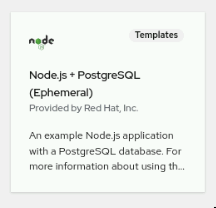

= Lab di esercitazione n.1

== Descrizione

Occorre eseguire il deploy e la customizzazione di una applicazione **NodeJS + PostgreSQL**.

=== Installazione

* I workloads saranno aggiunti nel progetto `nodejs` che dovete creare.
* Dalla vista Developer, creare template Nodejs + PostgreSQL (ephemeral) nel progetto
* Impostare username/password del DB (lasciare il Databasename di default `my_data`)

* Verificare che l'applicazione sia raggiungibile tramite Route dell'applicazione NodeJS

=== Impostazione Probes

L'applicazione NodeJS include già dei readiness e liveness endpoints. Potete verificare quali sono entrando nel Pod NodeJS ed ispezionando i files Javascript (js) presenti. 

* Impostare un readiness probe sul DeploymentConfig in base all' endpoint disponibile. Usare questi settaggi:
  - initial-delay-seconds=5 
  - period-seconds=15 
  - failure-threshold=2

* Impostare un liveness probe sul DeploymentConfig in base all'endpoint disponibile. Usare questi settaggi:
  - initial-delay-seconds=5 
  - period-seconds=15 
  - failure-threshold=2

=== Aggiunta Dati

* Connettersi al Pod del DB in rsh
* Usare il tool **psql** presente nel Container del DB per inserire dei dati di esempio.

----
psql -U postgresql -d my_data
----

* Inserisci dei dati nella Tabella products  
  
----
INSERT INTO products (id, name, stock) VALUES
  (4, 'Banana', 15),
  (5, 'Mango', 20),
  (6, 'Peach', 12),
  (7, 'Grapes', 18),
  (8, 'Kiwi', 9);
----
  
Verificare nella route di NodeJS che i prodotti siano presenti.
